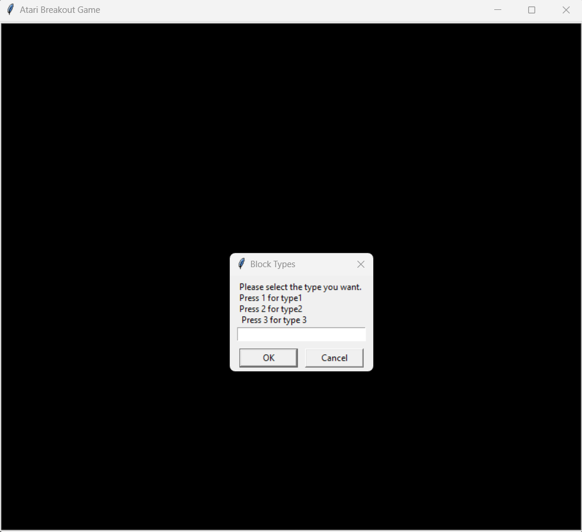
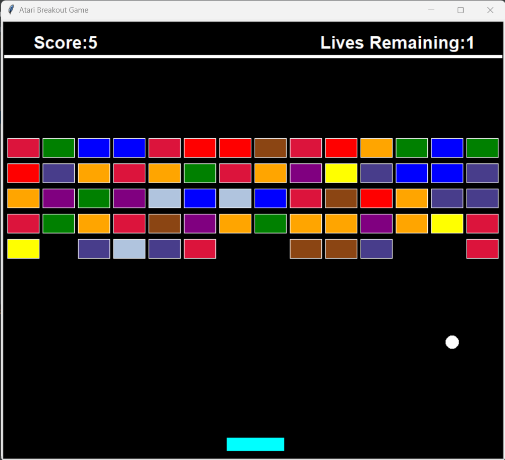
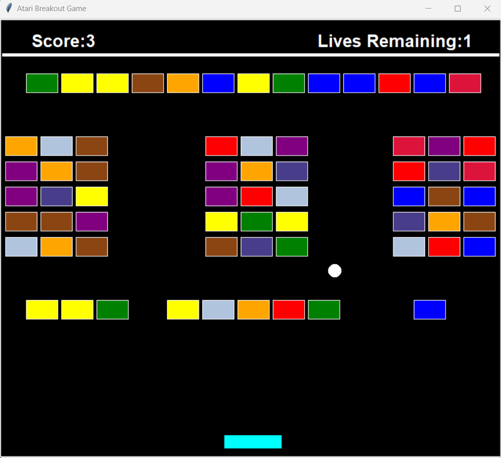
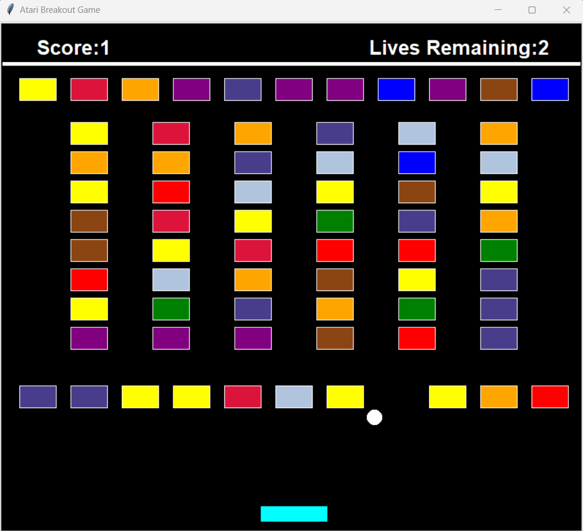
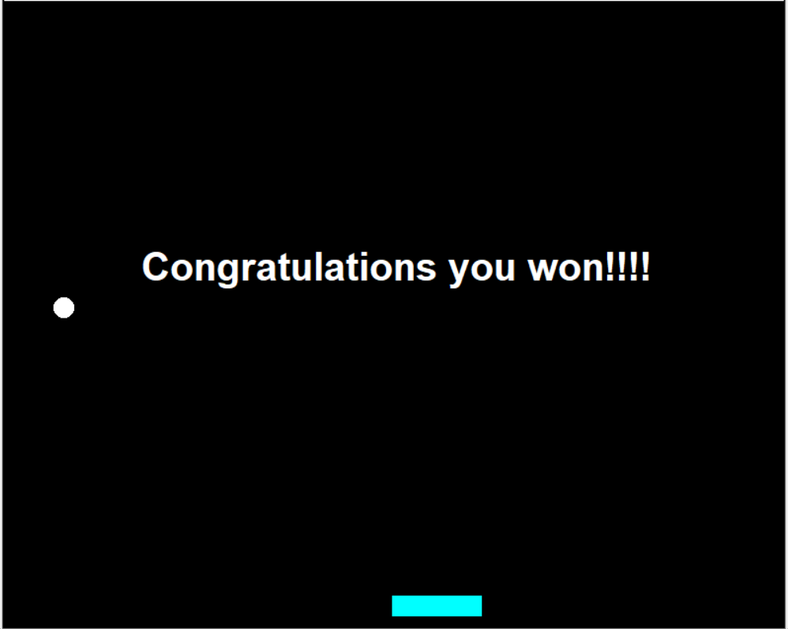

# 🕹️ Atari Breakout Game 🌟

This is a Python implementation of the classic Atari Breakout game using the Turtle graphics library. The game features a ball that you control using the arrow keys on your keyboard, three lives to complete the game, and three different level options with varying brick layouts. 🐢

## Requirements
- Python 3.X or more 🐍
- Turtle module comes preinstalled in python and no need to install it separately. 🎨

## Instructions

- Use the **left** and **right** arrow keys to move the paddle left and right. ⬅️➡️
- Break the bricks by bouncing the ball off the paddle and into the bricks. 🧱
- You have **3 lives** to complete the game. ❤️
- There are three different level options to choose from, each with a unique brick layout. 🌟
- Your goal is to clear all the bricks in the level and achieve the highest score. 🏆

## Gameplay Controls

- **Left Arrow**: Move the paddle left. ⬅️
- **Right Arrow**: Move the paddle right. ➡️

## Features

- Classic Atari Breakout gameplay. 🎮
- Customizable difficulty levels. 🔧
- Score tracking. 📈
- Lives counter. 💖

## Customizing Levels

Before starting the game, you have the flexibility to choose from three different brick layouts. The game provides a user-friendly interface with a Turtle message box that presents these options, allowing you to select the level of challenge that suits your preference. Each layout offers a unique arrangement of bricks, adding variety and excitement to your gameplay experience. Simply make your selection and embark on your Atari Breakout adventure with the layout of your choice. 🌟

## Working of Game:

### Choosing difficulty:

### Type 1 brick layout:

### Type 2 brick layout:

### Type 3 brick layout:

### Game Won:

### Game Over:

